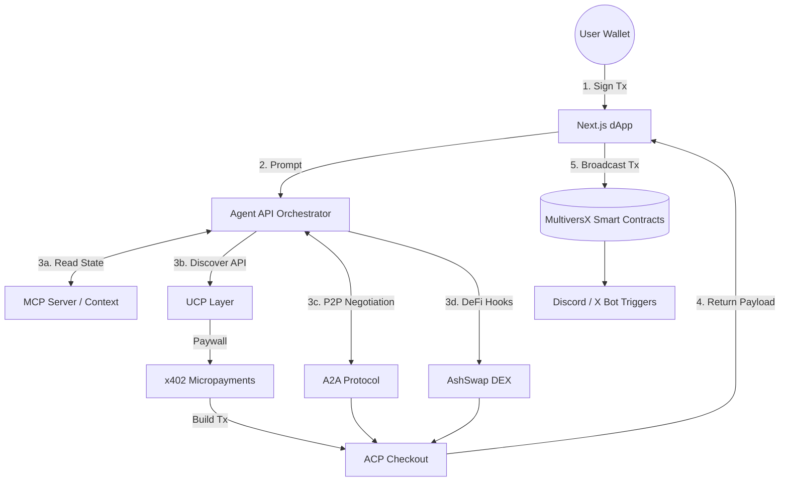

# 🚀 mx-agentic-commerce
 
[](https://vercel.com/new/clone?repository-url=https%3A%2F%2Fgithub.com%2FGzeu%2Fmx-agentic-commerce&project-name=mx-agentic-commerce&framework=nextjs&root-directory=frontend)

Supernova Devnet project demonstrating Agentic Commerce using UCP, ACP, x402, and MCP. This framework enables human-to-agent and agent-to-agent negotiations settling at sub-second speeds on MultiversX.

## 🏗️ Architecture Stack



## 🌟 Features
- **Frontend dApp**: Next.js 15 UI with Glassmorphism, real EGLD balance, and Web3 wallet integration (xPortal).
- **Agent Terminal**: Chat interface simulating the Agent Orchestrator.
- **Smart Contracts**: Rust-based contracts for Agent Registry, Commerce Engine, and Reputation NFTs.
- **Agent-to-Agent (A2A)**: Implements peer-to-peer AI agent negotiation protocols.
- **DeFi Utility**: Integrated stubs for token swaps (via AshSwap).
- **Social Gamification**: Automated triggers for Discord/X to notify community of Agent successes.

## 🛠️ Getting Started

### 1. Install Dependencies
```bash
npm install
```

### 2. Run the Frontend
```bash
npm run dev:frontend
```
Open `http://localhost:3000` to interact with the Terminal. Try typing: 
- *"Negotiate a cheaper price for me"* (A2A Flow)
- *"Swap my USDC for EGLD"* (DeFi Flow)

### 3. Deploy Smart Contracts to Devnet
Ensure you have a funded `agent.pem` file in the root directory.
```bash
npm run contracts:deploy
```

## 🗺️ Roadmap
See our [ROADMAP.md](./ROADMAP.md) for our path towards Q1 2027 Mainnet readiness.
